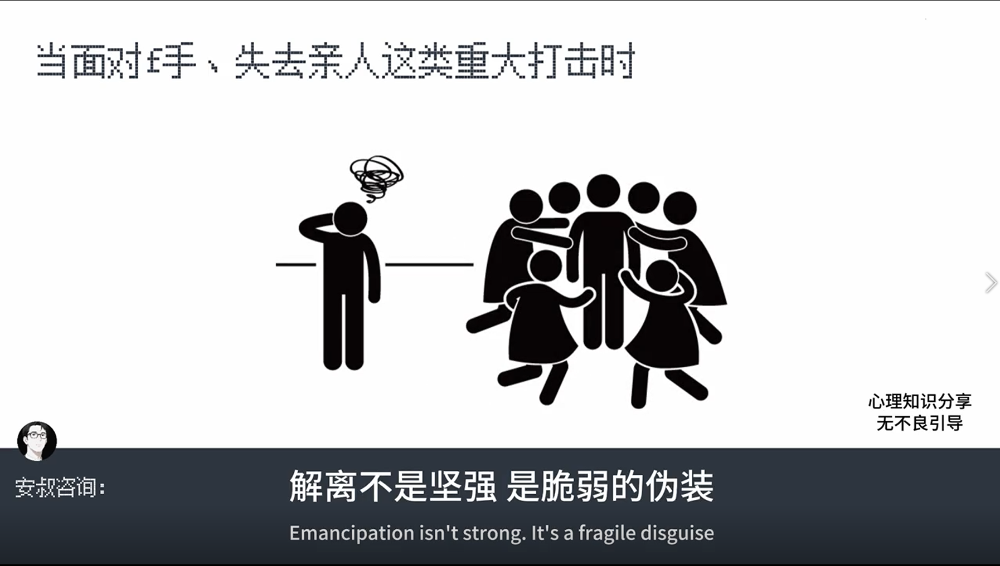
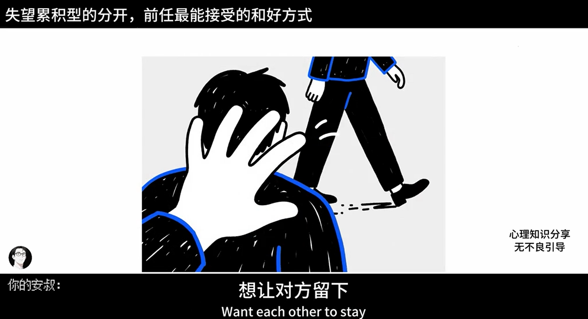

# Coze 工作流集合

这是一个 Coze 工作流的集合，用于视频处理和内容重写任务。

## 目录结构

```
coze-workflows/
├── workflows/           # 工作流 JSON 文件（原始版 + 脱敏版）
│   ├── RewriteFlow.json              # 原始版本，包含真实 ID
│   ├── sanitized_RewriteFlow.json     # 脱敏版本，用于分享
│   ├── VideoPipeline.json            # 原始版本，包含真实 ID
│   └── sanitized_VideoPipeline.json # 脱敏版本，用于分享
├── images/              # 工作流截图
├── .gitignore
├── .env.example        # 环境变量模板
├── README.md           # 英文文档
├── README_CN.md        # 本文件
└── sanitize.ps1        # 敏感数据脱敏脚本
```

## 快速开始

### 1. 克隆与设置

```bash
git clone <你的仓库地址>
cd coze-workflows
```

### 2. 配置环境

复制环境变量示例文件并填写你的凭证：

```bash
cp .env.example .env
```

编辑 `.env` 文件，填入你实际的 Coze API 凭证。

### 3. 导入工作流

1. 访问 [Coze](https://www.coze.cn)（或 [coze.com](https://www.coze.com)）
2. 进入你的工作空间
3. 从 `workflows/` 文件夹导入工作流 JSON 文件

## 工作流说明

### RewriteFlow
文本重写工作流，处理剪贴板内容并按照定义的规则进行转换。

### VideoPipeline
视频处理管道，处理视频 URL，提取内容并生成 ASR（自动语音识别）转录。

## 视频生成效果

VideoPipeline 工作流可以从图片生成视频。以下是生成的视频效果截图：

| 截图 | 说明 |
|------|------|
|  | 视频生成输出 - 113455 |
|  | 视频生成输出 - 113911 |


## 依赖要求

- Coze 账号及 API 访问权限
- （可选）工作流中引用的外部 API 服务

## 开源协议

MIT License
